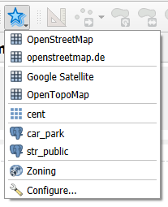
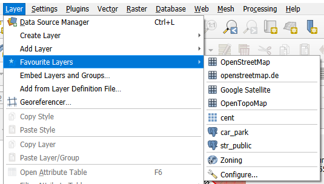
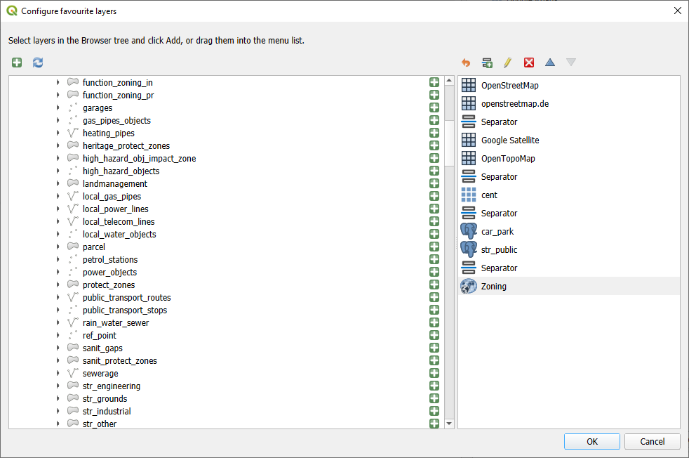

# Favourite Layers


QGIS plugin for quickly adding favorite Browser layers to the current project.

## Supported Versions

- QGIS minimum version: 3.16
- QGIS maximum version: 4.+
- Compatible with QGIS 3.x on Qt5 and prepared for QGIS 4.x on Qt6.

## Features

- Custom QGIS toolbar with one icon button and a drop-down menu.
- The same **Favourite Layers** menu is also added as an item in the QGIS **Layer** menu.
- Each favourite layer action uses a QGIS layer-type icon.
- Menu separators can be added and reordered in the settings dialog.
- The last menu item opens the settings dialog.
- Settings dialog has a menu list and a filtered QGIS Browser layer tree.
- Layers can be added by the plus icon button or by dragging Browser layer items into the menu list.
- The favourite list is stored with `QgsSettings`, so every QGIS user profile keeps its own list.
- If plugin settings are missing, a default OpenStreetMap XYZ tile layer is added to the menu.

## Installation

You may install the plugin from the ZIP package stored in the repository folder:

```text
repo/favourite_layers.zip
```

In QGIS:

1. Open **Plugins > Manage and Install Plugins...**.
2. Open **Install from ZIP**.
3. Select `repo/favourite_layers.zip`.
4. Click **Install Plugin**.
5. Enable **Favourite Layers** if QGIS does not enable it automatically.

After installation, the plugin adds:

- a **Favourite Layers** toolbar button with a drop-down menu;
- a **Favourite Layers** submenu in the QGIS **Layer** menu.

## Screenshots

Favourite Layers toolbar menu:



Favourite Layers submenu in the QGIS Layer menu:



Settings dialog:



## License

MIT License. See `LICENSE`.
